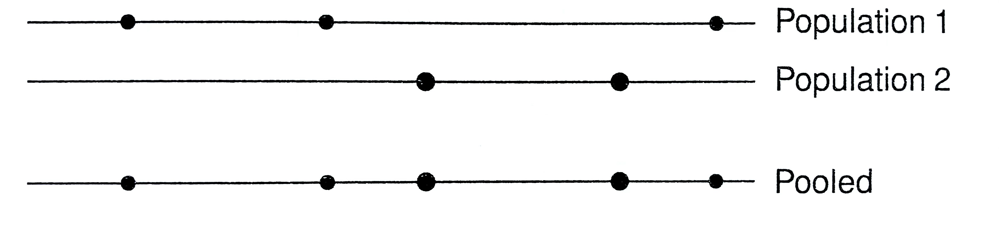

 
 

이전 챕터에서 $k$개의 population에 대해 귀무가설 $H_0:A_1=\cdots=A_k=:A$를 어떻게 가설검정 하는지에 대해서 공부했다. 요약하면 $h$번째 그룹의 Nelson-Aalen estimator $\hat A_h(t)$와 pooled sample의 Nelson Aalen estimator $\hat A(t)$의 차이값인 $\hat A_h(t)-\hat A(t)$를 이용하여 마치 ANOVA에서와 유사한 방식으로 weighted quadratic sum을 계산했다. 여기서 우리는 Martingale property를 이용하기 위해 $\hat A(t)$대신 매우 유사한 값인 $\tilde{A}_h(t)$를 이용했고, $\hat A_h(t)-\tilde{A}_h(t)$의 covariance structure를 구해내어 결국 chi-square statistic을 도출해냈다. 이번에는 특히 $k=2$일 때의 케이스들에 대하여 집중적으로 다루어보고 어떤 test들과 결과들을 얻을 수 있는지에 대해 알아볼 것이다.

 
 

##### Remark (The case $k=2$)
For the case $k=2$, we can use $Z_1(t)$ instead of a quadratic from in $(Z_1(t), Z_2(t))$. We can then do one-sided tests. 

  - 무슨 말이냐면 $k$가 3 이상이면 $H_0:A_1=A_2=\cdots=A_k$, vs  $H_1:$ one of them are not equal이 되지만, $k$가 2라면
$$
H_0: A_1\le A_2 \mbox{ }\mbox{ }\mbox{ vs }\mbox{ }\mbox{ } H_1:A_1>A_2
$$
처럼 one-sided test를 할 수 있다. 즉, 위의 가설에서 $Z_1=\hat{A}_1(t)-\hat{A}(t)$이 만약 값이 엄청 크다면, $H_0$을 기각할 수 있다. 때문에 quadratic form을 고려하지 않고 $Z_1$에 대한 normal 분포만 이용해서 검정을 할 수 있다. 때문에 $k=2$인 경우 계산이 매우 간단하다.

 

By routine algebra, we see that
$$
Z_1(t)=\int_0^t L(s)d\hat A_1(s)-\int_0^t L(s)d\hat A_2(s)
$$
and
$$
\sigma_{11}(t)= \int_0^t \frac{L^2(s)}{Y_1(s)Y_2(s)}dN_\cdot(s),
$$
where
$$
L(s) = \frac{K(s)Y_1(s)Y_2(s)}{Y_\cdot(s)}.
$$

This is because, $Z_1(t)=\int_0^t K_1(s)d(\hat A_1-\tilde{A}_1)(s)=\int_0^t K(s)Y_1(s)d(\hat A_1-\tilde{A}_1)(s)$. By ignoring $J$'s, we have
$$\begin{align*}
Z_1(t)&= \int_0^t K(s)Y_1(s)d(\hat A_1-\tilde{A}_1)(s)\\
&=\int_0^t K(s)Y_1(s)\left(\frac{dN_1(s)}{Y_1(s)}-\frac{dN_\cdot(s)}{Y_\cdot(s)}\right)\\
&=\int_0^t K(s)dN_1(s)-\int_0^tK(s)\frac{Y_1(s)}{Y_\cdot(s)}dN_\cdot(s)\\
&=\int_0^t K(s)dN_1(s)-\int_0^tK(s)\frac{Y_1(s)}{Y_\cdot(s)}dN_1(s)-\int_0^tK(s)\frac{Y_1(s)}{Y_\cdot(s)}dN_2(s)\\
&=\int_0^t K(s)\frac{Y_2(s)}{Y_\cdot(s)}dN_1(s)-\int_0^tK(s)\frac{Y_1(s)}{Y_\cdot(s)}dN_2(s)\\
&=\int_0^t K(s)\frac{Y_1(s)Y_2(s)}{Y_\cdot(s)}d\hat A_1(s)-\int_0^tK(s)\frac{Y_1(s)Y_2(s)}{Y_\cdot(s)}d\hat A_2(s) \mbox{ } \mbox{ } \mbox{ }\left(\because d\hat A_1(s)= \frac{1}{Y_1(s)}dN_1(s)\right).\\
\end{align*}$$
The expression for $\hat\sigma_{11}(t)$ is obtained by blindly plugging in to the formula for $\hat\sigma_{hj}(t)$ in the previous chapter while ignoring $J$'s.

 
 

##### Remark (The Mantel Haenszel Test)
Let $K(s)=I(Y_\cdot(s)>0)$. 

Consider the set of all points at which there is at least one observed death. For each such point, we will make a $2\times 2$ table to test the null hypothesis that the "hazard rates" for the two populations are equal at that point. 

Consider such a point $t$. We have
 - $dN_1=$ number from population 1 who die at the point
 - $dN_2=$ number from population 2 who die at the point
 - $Y_1=$ number from population 1 known for sure to be alive at time $t-$
 - $Y_2=$ number from population 2 known for sure to be alive at time $t-$

We have the table

|              |  No. Dead   |  No. Alive  |
|:------------:|:-----------:|:-----------:|
| Population 1 | $dN_1$      | $Y_1-dN_1$  |
| Population 2 | $dN_2$      | $Y_2-dN_2$  |

Add to the table the rwo and column totals:

|              |  No. Dead   |  No. Alive          |  Total     |
|:------------:|:-----------:|:-------------------:|:----------:|
| Population 1 | $dN_1$      | $Y_1-dN_1$          |  $Y_1$     |
| Population 2 | $dN_2$      | $Y_2-dN_2$          |  $Y_2$     |
|              | $dN_\cdot$  | $Y_\cdot-dN_\cdot$  |  $Y_\cdot$ |

Now, recreate the table, without the internal counts:

|              |  No. Dead   |  No. Alive          |  Total     |
|:------------:|:-----------:|:-------------------:|:----------:|
| Population 1 |             |                     |  $Y_1$     |
| Population 2 |             |                     |  $Y_2$     |
|              | $dN_\cdot$  | $Y_\cdot-dN_\cdot$  |  $Y_\cdot$ |

Note that if we know the margins of the table, then $dN_1$ determines the other three entries in the table.

Fisher's exact test, which conditions on the margins, involves looking at $dN_1$, or equvalently $dN_1-E_{H_0}(dN_1)$, where the expectation is taken under the null hypothesis. 

Here, the null hypothesis is that given that you are alive at time $t-$, the probability of dying in the next time instant is the same for the two populations. 

The $dN_1$ has a hypergeometric distribution *if the null hypothesis is true*

 
 

[back](../sa.html)